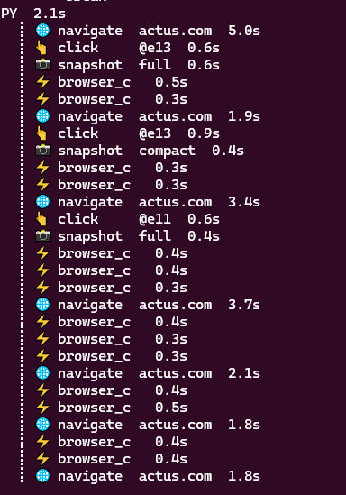
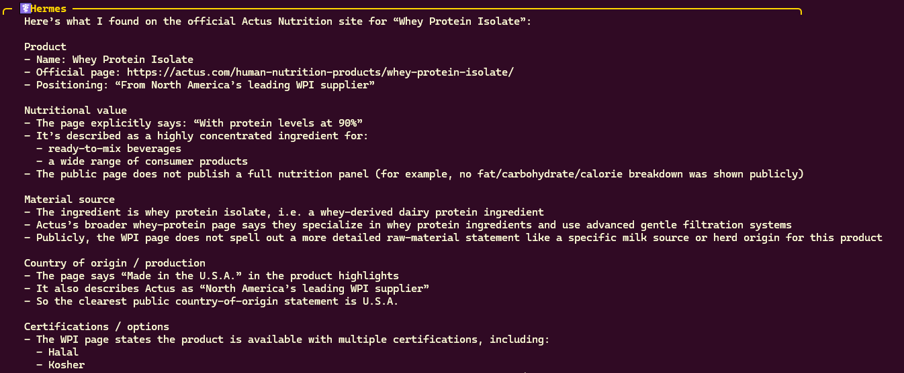
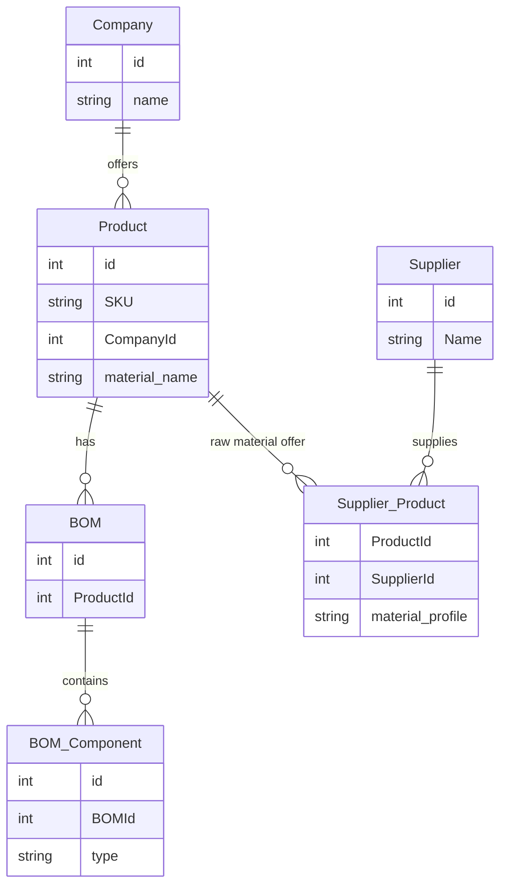
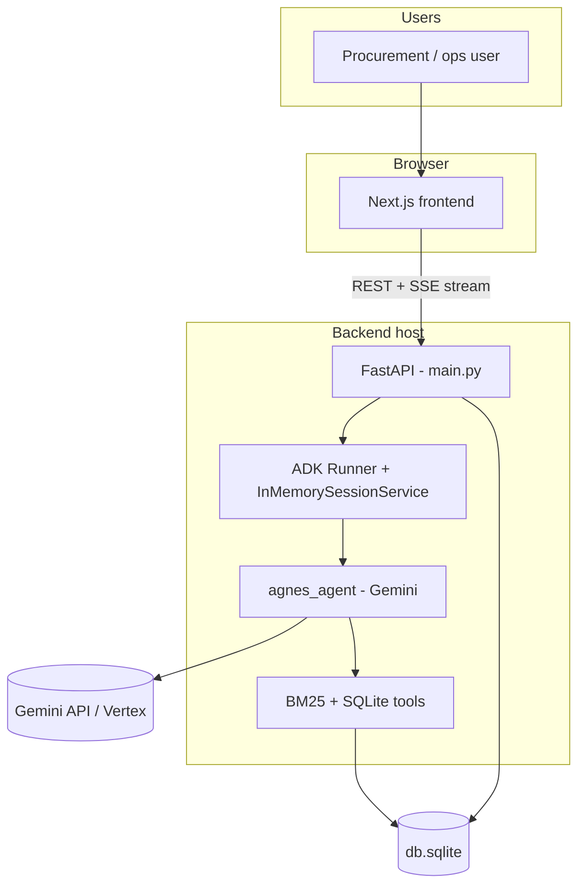
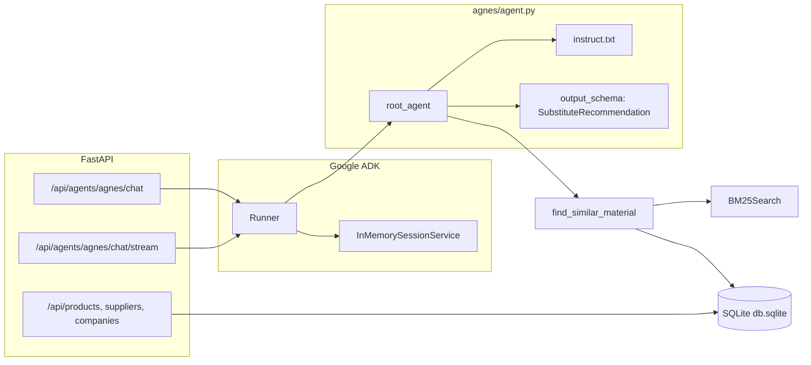
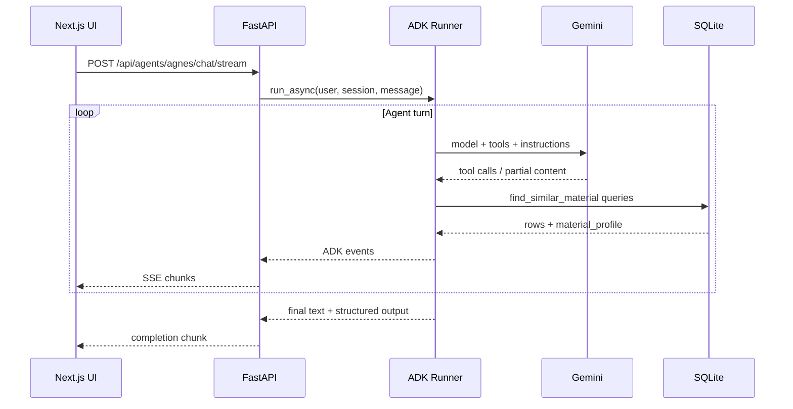

# Agnes: AI sourcing decision support

Prototype built for the **TUM.ai × Spherecast** hackathon: an AI assistant that helps explore **raw-material substitutes**, supplier context, and structured recommendations over provided **BOM and supplier data**.

## Hackathon and challenge

**Spherecast** frames the problem around **Agnes**, an AI supply chain manager: fragmented purchasing hides real volume, consolidation only helps when materials are truly substitutable, and any recommendation must remain defensible on **quality and compliance**.

## What this repository implements

- **Next.js (App Router)** UI for master data (companies, products, suppliers) and an **Agnes** chat surface that consumes the streaming agent API.
- **FastAPI** service exposing REST endpoints over **`database/db.sqlite`** plus **`POST /api/agents/agnes/chat`** and **`POST /api/agents/agnes/chat/stream`** for the agent.
- **Google ADK** `Runner` with a **Gemini**-backed `Agent` (`backend/agnes/agent.py`) that uses a **BM25** tool over material names and returns **structured substitute recommendations** (`SubstituteRecommendation` schema).

---

## Architecture

### Enriched data model

- Added 'material_name' column in the 'Product' table which is a human/AI readable version of SKU. This is used by the agent harness to find information about the raw materials. 
- Added 'material_profile' column to the 'Supplier_Product' table to add the enriched information about raw materials, eg. Certifications, nutritional value, ingredient profile etc.

### Data Enrichment Strategy

Enrichment is driven by the **Hermes agent harness** skill [`supplier-material-profiling`](hermes-agent-harness/supplier-material-profiling/SKILL.md): it reads supplier and raw-material rows from **SQLite**, researches each material on the **web** (browser toolset), and writes **structured, comparable** profiles back to **`Supplier_Product`** so Agnes and BM25-style matching can use richer facts than SKU text alone.

- **Inputs**: database path, an optional SQL query (otherwise a default join on `Product`, `Supplier_Product`, and `Supplier` returning supplier name and `Product.material_name`), and rules for granularity (per row, per unique material, or supplier-specific when facts differ).
- **Preparation**: normalize material labels (strip packaging noise, keep grades or chemical identifiers, dedupe) so research keys stay stable and work is not repeated unnecessarily.
- **Research**: prefer supplier product pages, technical or product data sheets, SDS where relevant, certification or compliance documents, then official regulatory or nutrition databases; use secondary sources only when primaries are missing. Important claims are cross-checked when ambiguous.
- **Output shape**: compact structured profiles (for example certifications, ingredient profile, nutritional values, allergens, functional properties, processing, origin, specifications, compliance notes, cited **sources**, and a **confidence** level) rather than long prose, serialized to the material profile column so rows stay machine-usable.
- **Safety and auditability**: do not invent certifications, percentages, or nutrition facts; persist uncertainty, conflicts, and unresolved materials explicitly; verify updates with read-back queries and transactions when batching writes.

The skill file documents required tools (terminal/SQLite access and browser tooling), SQLite details such as quoting hyphenated column names when applicable, failure handling, and reporting expectations for a completed enrichment run.

**Hermes harness (examples).** Browser automation trace while researching a supplier site (navigate, click, snapshot, console checks):



Structured facts gathered from a public product page (example: whey protein isolate on Actus Nutrition—product link, protein level, sourcing notes, origin, certifications):






### System context

High-level placement of the UI, API, agent runtime, model, and local data.



### Backend composition

How the Agnes route, runner, and tools connect inside the Python service.



### Streaming chat flow

Typical path when the UI calls the streaming endpoint (simplified).




---

## Local development

### Prerequisites

- Python **3.11+** with **[uv](https://github.com/astral-sh/uv)** for the backend  
- **Node.js** for the frontend  
- **Google API access** for the agent: set `GOOGLE_API_KEY` (or `GEMINI_API_KEY`, which the app maps) in `backend/.env` and/or `backend/agnes/.env` - see `main.py` for Vertex alternatives  

### Backend

```bash
cd backend
uv sync
uv run uvicorn main:app --reload --port 8000
```

Health check: `GET http://localhost:8000/healthz`

### Frontend

```bash
cd frontend
npm install
npm run build
```

Set `NEXT_PUBLIC_BACKEND_URL` if the API is not on `http://localhost:8000`. The API uses `FRONTEND_ORIGIN` (default `http://localhost:3000`) for CORS.

---

## Repository layout

| Path | Role |
| ---- | ---- |
| `frontend/` | Next.js app (master data pages, Agnes chat) |
| `backend/main.py` | FastAPI app, SQLite reads, ADK runner wiring |
| `backend/agnes/` | Agent definition, instructions, BM25 tool |
| `backend/database/db.sqlite` | Challenge dataset |

---

## License / attribution

Dataset and challenge framing belong to the **Spherecast** / hackathon organizers; this repo is a team submission implementing the described use case over the provided SQLite dump.
